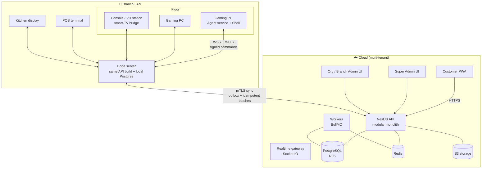
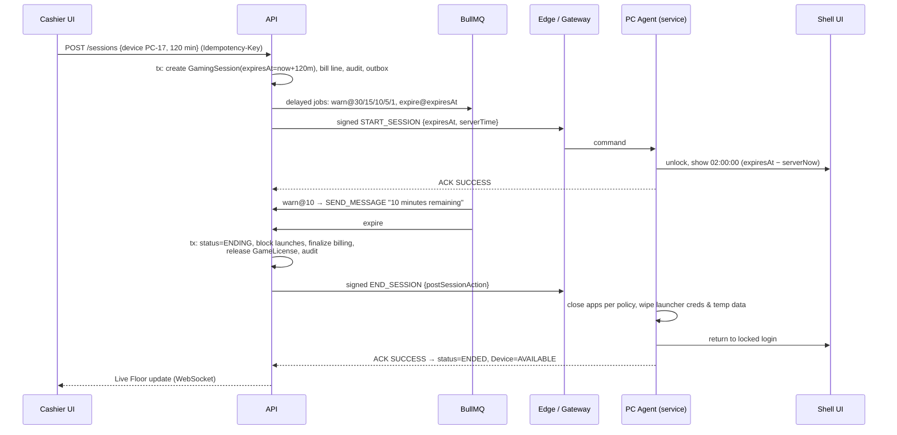

# 01 · Architecture

ArenaOS is a multi-tenant SaaS for gaming cafés, esports arenas, internet cafés, console/VR centres and gaming restaurants. It is an original product. It covers the same kinds of features as existing gaming-centre platforms but doesn't reuse their UI, branding or code.

**Core principle:** one customer account, one wallet, one session system, one POS, one inventory and one reporting system, with central device control. They sync in real time and keep working at the branch when the internet is down.

## 1. Deployment model — hybrid cloud + branch edge



> **Not built yet (Phase 13).** Today every device talks to the cloud API directly; only the station agent keeps working offline (session timer and fail-safe lock). The edge design below is the target.

- **Floor devices only talk to the branch edge server over the LAN.** Session timers, lock/unlock, POS, KDS and the Live Floor keep working if the internet drops.
- **The edge runs the same API build** in `EDGE` mode with a local PostgreSQL holding the branch's slice of data. That slice is active sessions, pricing, station state, the menu, cached customer balances, and POS orders and payments.
- **Sync (Phase 13):**
  - Cloud → edge uses a change cursor (`EdgeNode.syncCursor`).
  - Edge → cloud sends `SyncBatch`es of mutations. Each mutation carries its own idempotency key, so replaying a batch never double-charges.
- **Internet-only features degrade gracefully.** Online and QR payments and remote app bookings are unavailable while offline. SMS, email and WhatsApp are queued. Cross-branch reports lag until sync catches up.
- **On-premise option:** the same edge build can run as a fully standalone install with no cloud tenant. This is a supported deployment mode for venues with poor connectivity or data-residency rules.

## 2. Technology

| Layer | Choice |
|---|---|
| Admin (Super Admin, Org, Branch) | Next.js · TypeScript · Tailwind · shadcn/ui |
| Customer app | Next.js PWA (React Native later) |
| KDS / POS | React PWA (installable, offline-capable) |
| Backend | NestJS + TypeScript, modular monolith |
| Database | PostgreSQL 17 · Prisma 7 (`@prisma/adapter-pg`) |
| Cache / pub-sub / locks | Redis |
| Queues & timers | BullMQ |
| Realtime | Socket.IO (staff/customer UI), raw WSS + mTLS (device agents) |
| Object storage | S3-compatible (MinIO locally) |
| Windows client | .NET 8: **Agent** = Worker Service (LocalSystem); **Shell** = WPF (WinUI 3 optional) |
| Infra | Docker · Caddy · GitHub Actions · AWS or Azure |

**Why a modular monolith and not microservices:** a single deployable keeps transactions local. That matters because "end session → finalize bill → release license → post journal" must be atomic. The edge server can also run the exact same build. Modules talk to each other through exported services and domain events (outbox) and never reach into each other's tables. Any module can be split out later behind the same event contracts.

## 3. Repository layout

```
packages/
  db/          Prisma schema (per bounded context), migrations, RLS generator,
               tenant-scoping client, schema/tenancy tests
  rbac/        permission catalog, role templates, authorize()
  contracts/   feature flags, device command protocol (signing/verification)
apps/          (Phase 2+) api · admin · customer · kds · edge
clients/       (Phase 3+) windows/ Agent + Shell (.NET 8)
infra/         docker-compose, Postgres role bootstrap
docs/
```

## 4. Backend modules

`auth · organizations · branches · zones · devices · device-agent · sessions · pricing · customers · memberships · wallet · bookings · games · launchers · licenses · updates · tournaments · pos · restaurant · kds · tables · products · inventory · purchases · suppliers · employees · shifts · payments · accounting · loyalty · promotions · notifications · crm · reports · integrations · audit · subscriptions · support · system-health`

Each module owns:
- its Prisma file (`packages/db/prisma/schema/<context>.prisma`);
- a NestJS module with controllers, services and guards;
- the domain events it emits, through `OutboxEvent`.

Cross-cutting concerns live in shared infrastructure, never in individual modules:
- tenant context
- RBAC guard
- audit interceptor
- idempotency interceptor

## 5. Request pipeline (API)

```
TLS → rate limit (Redis) → authenticate (JWT / device mTLS / API key)
    → resolve TenantContext from the *verified* credential
    → RBAC guard: authorize(principal, permission, target, {reason})
    → idempotency interceptor (mutations with Idempotency-Key)
    → db.withTenant(ctx, tx => service(...))   ← RLS + scoped Prisma
    → audit interceptor writes AuditLog in the same transaction
    → outbox relay → Redis pub/sub → WebSocket fan-out / BullMQ / webhooks / edge
```

## 6. Live command system (devices)

Every remote action is a persisted `DeviceCommand`, then a signed envelope (`packages/contracts/src/device-protocol.ts`):

```
{ v, commandId, organizationId, branchId, deviceId, type, payload,
  requestedBy, issuedAt, expiresAt, nonce, keyId }  +  Ed25519 signature
```

- **Transport:** WSS with mTLS. Each PC has its own client certificate (`DeviceCredential`), issued once through a single-use `DeviceEnrollmentToken`.
- **Signing:** commands are signed with the branch's private key, which lives on the server or edge in a KMS/HSM. **The PC holds only the public key**, so a tampered PC can't forge commands. No privileged backend credential ever ships in the client.
- **Checks the agent runs before executing anything:**
  - signature is valid
  - `organizationId`/`branchId`/`deviceId` match its own certificate
  - the command hasn't expired
  - `commandId` hasn't been seen before (replay protection)
- **Acknowledgements:** the agent reports `RECEIVED → EXECUTING → SUCCESS | FAILED`. These update `DeviceCommand.status` and are pushed to the Live Floor.
- **Heartbeats** every ~10 s carry telemetry (`DeviceHeartbeat`). The device is marked `OFFLINE` after 3 misses.

## 7. Server-authoritative session expiry (mandatory flow)



Things that make the timer reliable:
- **The truth is `GamingSession.expiresAt` on the server.** The shell only renders it, so restarting the shell UI changes nothing. The agent is a Windows service that restarts the shell, and it keeps the last signed `expiresAt` itself. If it loses contact with the server, it still locks the PC at expiry (fail-safe).
- **A sweeper backs up the delayed jobs.** Every 15 s it queries `status IN (ACTIVE, ENDING) AND expiresAt < now()` (indexed), so expiry fires even if Redis loses a job.
- **The database blocks a second live session.** At most one live session per station is enforced by an `EXCLUDE` constraint.

## 8. Windows client (Phase 3–5)

| Component | Runs as | Responsibilities |
|---|---|---|
| **Arena Agent** (Worker Service) | LocalSystem | mTLS connection, command verification and execution, heartbeat/telemetry, process control, launcher credential injection and cleanup, maintenance-mode authorization, watchdog for the Shell, self-update (signed `ClientRelease`) |
| **Arena Shell** (WPF) | Kiosk user session | Login (password, QR, PIN, guest), timer, games/platforms/apps/internet/peripherals/connectivity/food/support. Talks to the Agent over a local named pipe with an ACL. Holds no secrets. |

- **Locking the PC down** uses a dedicated local kiosk account with Assigned Access / a Shell Launcher-style replacement. It adds AppLocker/WDAC policies, disables Task Manager, registry editing and command prompts through policy, and filters key combinations (Win, Alt+Tab, Ctrl+Alt+Del handling). The agent re-applies the policy on every login.
- **Maintenance mode:**
  - The hotkey only *opens the prompt*.
  - The PIN/RFID/credential is verified **by the server** against `station.maintenance`. The tools that unlock come from `shell.tools` and similar permissions.
  - The session is time-boxed, and every action is logged to `MaintenanceSession` and `AuditLog`.

## 9. Security summary

- **Tenant isolation:** three independent layers (see [05-multi-tenancy](05-multi-tenancy.md)).
- **Staff sign-in:**
  - JWT access tokens (5–15 min) and refresh tokens rotated with reuse detection (`RefreshToken.familyId`).
  - Argon2id password hashes.
  - MFA (TOTP/WebAuthn), mandatory for owners, admins and platform staff.
- **RBAC** is enforced server-side on every sensitive action. Sensitive actions require a written reason (see [04-rbac](04-rbac.md)).
- **Secrets** (payment gateways, pooled game accounts, MFA seeds) are only *references* into the secret manager or KMS. Card data never touches our systems: we stay out of PCI scope by using PSP-hosted fields and tokens.
- **Append-only ledgers** plus an in-database hash-chained audit log that a nightly job re-verifies.
- **Idempotency keys** on every financial mutation and sync request, enforced by unique constraints.
- **Operations:** encrypted backups with PITR (WAL archiving), cross-region replica, restore drills (Phase 13).

## 10. Realtime channels

| Room | Subscribers | Events |
|---|---|---|
| `org:{id}:branch:{id}:floor` | staff consoles | device status, session start/extend/end, heartbeats (throttled) |
| `…:kds:{stationId}` | kitchen screens | ticket created/updated |
| `…:pos` | cashiers | orders, payments, bill changes |
| `customer:{id}` | customer app / shell | order status, session warnings, notifications |

Socket authorization reuses the same `authorize()` check as HTTP. A socket joins a room only if its principal holds the permission for that branch.
