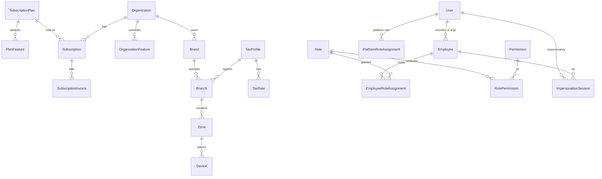
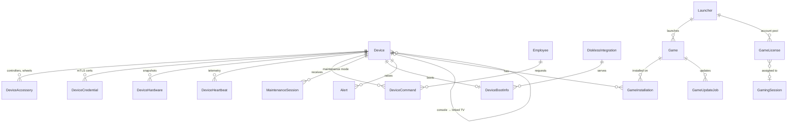
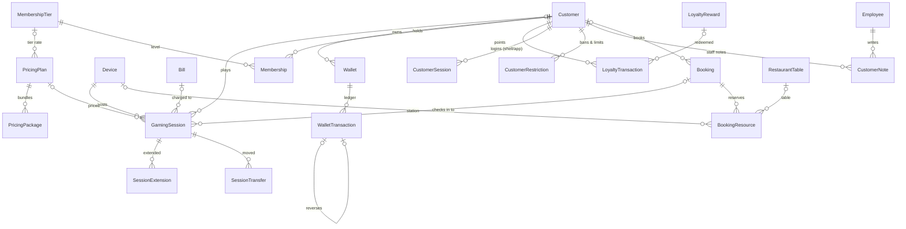
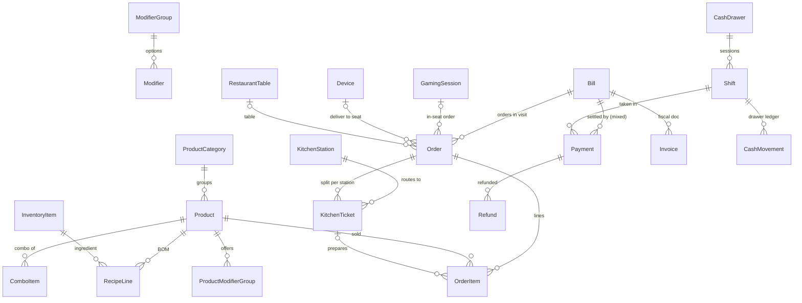
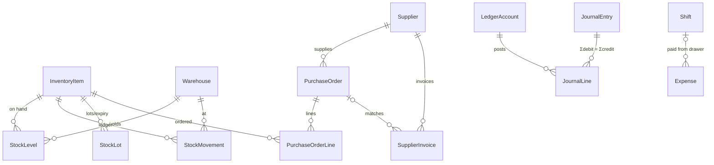
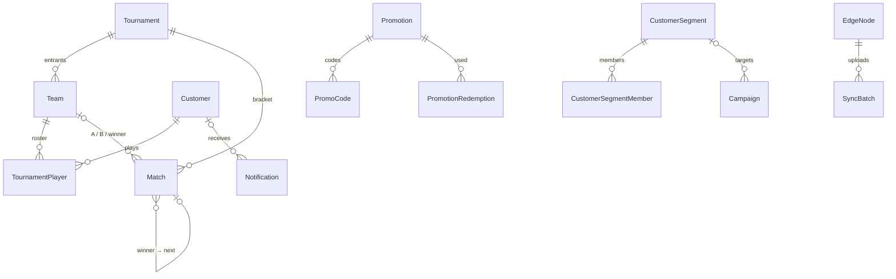

# 03 · Entity-relationship model

**Source of truth:** `packages/db/prisma/schema/*.prisma`, which defines 129 tables across 15 bounded contexts. The diagrams below show relationships only, split by domain. Every tenant entity also has `organizationId`, and its relations are composite `(fk, organizationId)`. That column is omitted below for readability.

| Context file | Tables |
|---|---|
| `platform.prisma` | Country, Currency, SubscriptionPlan, PlanFeature, ClientRelease, User, MfaFactor, PlatformRoleAssignment, RefreshToken, ImpersonationSession |
| `tenancy.prisma` | Organization, Subscription, SubscriptionInvoice, OrganizationFeature, Brand, Branch, Zone, TaxProfile, TaxRate, PaymentGatewayConfig |
| `iam.prisma` | Employee, Permission, Role, RolePermission, EmployeeRoleAssignment |
| `devices.prisma` | Device, DeviceAccessory, DeviceEnrollmentToken, DeviceCredential, DeviceHardware, DeviceHeartbeat, DeviceCommand, MaintenanceSession, RemoteSupportSession, DisklessIntegration, DeviceBootInfo, Alert, PeripheralProfile, BranchSigningKey |
| `games.prisma` | Launcher, Game, OrgGameSetting, GameInstallation, GameUpdateJob, GameLicense, ShellApp, DetectedTitle |
| `sessions.prisma` | PricingPlan, PricingPackage, GamingSession, SessionExtension, SessionTransfer, PrintJob |
| `customers.prisma` | Customer, CustomerNote, CustomerRestriction, CustomerSession, CustomerFavoriteGame, Achievement, CustomerAchievement, MembershipTier, Membership, Wallet, WalletTransaction, LoyaltyRule, LoyaltyReward, LoyaltyTransaction, Screenshot |
| `bookings.prisma` | Booking, BookingResource |
| `pos.prisma` | ProductCategory, Product, ProductBranchPrice, ModifierGroup, Modifier, ProductModifierGroup, ComboItem, RecipeLine, Bill, Order, OrderItem, KitchenStation, KitchenTicket, RestaurantTable |
| `inventory.prisma` | Warehouse, InventoryItem, StockLevel, StockLot, StockMovement, Supplier, PurchaseOrder, PurchaseOrderLine, SupplierInvoice |
| `finance.prisma` | Payment, Refund, CashDrawer, Shift, CashMovement, Invoice, LedgerAccount, JournalEntry, JournalLine, Expense, PostingCursor |
| `esports.prisma` | Tournament, Team, TournamentPlayer, Match |
| `marketing.prisma` | Promotion, PromoCode, PromotionRedemption, CustomerSegment, CustomerSegmentMember, Campaign |
| `staff-ops.prisma` | TimeClockEntry, HandoverNote, SessionFeedback |
| `system.prisma` | NotificationTemplate, Notification, PushSubscription, AuditLog, AuditChainHead, IdempotencyRecord, OutboxEvent, EdgeNode, SyncBatch, ApiKey, WebhookEndpoint, SupportTicket |

## Tenancy & identity

## Stations, device agent & games

## Sessions, pricing, customers, wallet, bookings

## Unified POS, restaurant & KDS

One **Bill** per visit aggregates gaming time, extensions, food and merchandise. Non-food items (gaming time, memberships, top-ups, printing, tournament entry) are **Products**, so everything prints on one invoice.

## Inventory, purchasing, accounting

## Esports, marketing, system

## Key invariants (enforced in the database)

These live in `prisma/migrations/0003_*` and `0004_*`.

| Invariant | Mechanism |
|---|---|
| No double booking of a station or table | GiST `EXCLUDE` on `(deviceId, tstzrange)` over live bookings |
| One live session per station | `EXCLUDE (deviceId)` where status is live |
| One open shift per cash drawer | `EXCLUDE (cashDrawerId)` where OPEN/CLOSING |
| A pooled account is used by at most one session | `EXCLUDE` + CHECK on `GameLicense` |
| Wallet and points never negative | CHECK on balances and `balanceAfter` |
| Journal entries balance | deferred constraint trigger |
| Ledgers are append-only | triggers + revoked privileges |
| Audit log is tamper-evident | per-org SHA-256 hash chain in a trigger + `app.verify_audit_chain()` |
| Retries never double-charge | `@@unique([organizationId, idempotencyKey])` on Payment, Refund, WalletTransaction, LoyaltyTransaction, StockMovement, SessionExtension, GamingSession, Order, Booking |
| Impersonation is justified and time-boxed | CHECK: reason of 10+ characters, 8 hours or less |
